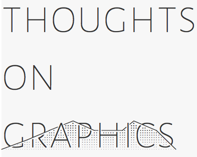

Graphs and visualizations form the basis most scientific understanding and communication, yet scientists put little work into creating effective graphics.

I use this repo to keep track of thoughts and ideas about presenting scientific data. 

The focus is on common-sense, logical, thoughtful suggestions and not dogmatic prescriptions.

Main document [here](https://github.com/lukereding/thoughts_on_graphics/blob/master/thoughts_on_graphs_and_graphics.md); thoughts on colors for qualitative and quantitative data + clean theme and color scales for `ggplot2` [here](https://github.com/lukereding/thoughts_on_graphics/blob/master/color_palettes.Rmd); notes on the Tufte classic [here](https://github.com/lukereding/thoughts_on_graphics/blob/master/notes%20on%20_the%20visual%20display%20of%20quantitative%20information.md).
