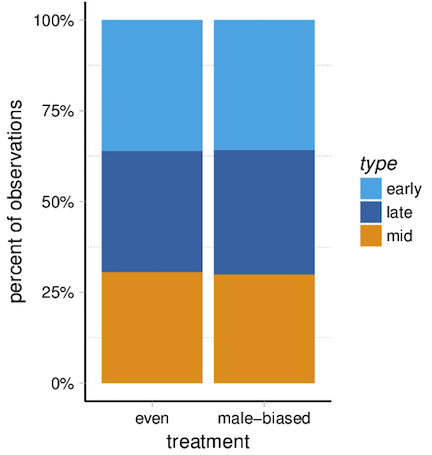

## thoughts on graph and data visualization

This markdown document is my long-deferred attempt to put down on paper some principles I think are useful when creating graphics. In my experience, scientists rarely put much effort into trying to understand what they're doing when they graph something, why they're doing it, how they con do it the best, and what their goal is in creating a visual representation of data.

In this document I will describe best practices for graphs and why I think they are the best practices (data on whether certain practices actually are better is thin though). Ideally, I'll include a bunch of example graphs here to illustrate good and bad practices.

This whole exercise is pointless, however, unless we identify what exactly it is we're trying to do:

### What _is_ a good graphic? What should a graphic do?

Your answer may deviate from mine, but to me a good graphic does two things:
* honestly shows the data
* makes it easy for the reader to understand some point you want to make

A graph is worthy of retention in a paper or a talk if it does one of these things really well. Otherwise, get rid of it. When possible--most of the time--graphics should aim to do both of these things really well. Why just show some relationship when you could actually show the data as well?

It's important to note that many graphs pass the second bullet point but deliberately ignore the first: they show you some relationship without showing you the data. Not only does this miss an upportunity to infuse your graphs with another dimension, but it a lot of cases it's dishonest. See the Anscombe's quartet example below for why this is dangerous.

## motivation: why graphs and graphics are essential

Anscombe's quartet illustrates how our trust of numbers without validating our intuition using a graphic is problematic. This quartet comprises four x, y vectors. Each pair of vectors has the same summary statistics (mean x, mean of y, covariance between x and y, and regression slopes). Yet when these four pairs of points are graphs on four scatterplots, it's clear the data are quite different:


By definition, summary statistics provide a simplified abstraction of our data, but the example above shows that we're lying to ourselves as scientists if make the fallacious mistake of relying on summary statistics to describe our data.

The image above also illustrates that our data often contains features we might not even be aware of: unknown unknowns that we simply haven't thought about or considered. For example, if I told you that two sets of data had the same means for x and y and covariances, you'd probably assume their scatterplots would look pretty similar. You probably wouldn't have even thought "I wonder if there are outliers that could cause this similarity?" or "Is it possible that the relationship between x and y could be different in this pair of data?"

As Daniel Kahneman writes about in his book _Thinking Fast and Slow_, the humans mind tends to be lazy. Part of the power of graphics is that they take tap into the strong visual processing parts of our brains and force us not to be lazy when it comes to interpreting data.

This is why graphs are so powerful and so essential.

# guiding principles about graphics

Below I outline guiding principles I think are important when creating a graphic.

* every part of the graph should have a clear purpose

   Extra bells and whistles are distracting. Often when graphs contain a bunch of things that don't need to be there, I get stuck trying to figure out what they mean, only to realize minutes later that they don't mean anything. This is not to say that all parts of a graphic should have a _unique_ purpose: redundency is an important aspect of design and I often find it useful to use in graphs, as different people probably have different ideal ways of viewing something. But if some element of our graphic isn’t serving a clear purpose, strip it away.
   
* show the data, some summary of the data or parameter estimate of interest, and some measure of variability about that estimate
* clearly label sample sizes
* state some measure of effect size
* state the the test used to assess statistical significance and the resulting p-value
* don't extrapolate

## thoughts on color

Color can be a powerful visualize element in a graphic. But it has to be used carefully and thoughtfully. 

## issues with color schemes

There are three main issues that can plague a given color scheme:

* Not distinguishable to readers with red/green colorblindness.
* Luminance of the colors is the same, thus hard to distinguish between colors when printed in black and white.
* For quantitative data: changes in luminance of the colors does not scale linearly with changes in the underlying variable the color represents. For example, a change in luminance from 10% black to 30% black should represent a comparable increase in the variable that is being represented. 

## recommendations

It seems like there may be too many variables to optimize here, but it's possible to develop color schemes that satisfy all these criteria. One solution is the [viridis](https://bids.github.io/colormap/) color scheme and its sister color schemes (plasma, magma, and inferno). However, these may not be suitable for qualitative data and imply some sort of ordinal ranking. The [cube helix](http://blogs.nature.com/methagora/2013/07/data-visualization-points-of-view.html) color scheme is a good alternative because their are greater changes in hue. Both of these are implemented in R (using the viridis package and the cubeHelix function of the rje package). 

An additional thought that really doesn't fit in here really well is that you should try to design figures so that they don't require captions. If you're using a lot of jargon and acronymns and representing things in a non-intuitive way, your reader has to head to the legend to even start to comprehend what's going on. Trying to tell a story with a graphic should obviate the need for a stuffed legend.

## other general things to be aware of

- **The difference between samples and populations.**

This dichotomy underlies a lot of differences in plot aesthetic choices, although it's never been made explicit to me.

In statistics, there are **populations** and there are **samples**. A population of interest might be the heights of all men in the US. We can't measure all the men in the US, and even if we could, we couldn't be sure we'd get every measurement just right due to measurement error and other things. The point being that populations are mythical beings: their properties (means, variances, etc.) are not just difficult to figure out, they're _unknowable_. 

But _samples_ offer us little glimpses into properties of the popualtions. We take a random sample of the population (e.g. a random sample of all males in the US and measure their height) and make inferences about the population based on the sample.

When we graph things, we have a choice: we can pay homage to the sample or the population. A lot of focus below in this document is on the sample, because I feel that that (a) a reader should understand the properties of the sample and (b) if a sample is crap, any inferences about the population are also crap. Either way, the reader should want to know something about your sample.

That time you plotted a bar plot with a standard error, you were making an inference about a population, because a standard error is the error concerning the mythical true mean of the population you're trying to estimate. When you switched it up that one time and plotted the standard errors instead, you were honoring the sample: standard deviations are properties of the sample, not the population (e.g. a standard deviation shouldn't change in one direction as your sample size increases, while the standard error will always get smaller).

Regardless of what choices you decide to make when you sit down and plot something, you should be aware of this dichotomy. You should think about whether you should be focusing on the sample or the population. Think about what a reader of your paper of an audience member at your talk would want to see.


# worked examples

## time x continuous variable

Let’s take a table (that somehow appeared in a _figure_ of a paper) and make it into a nice plot. Here’s the original table (paper doi 10.1016/j.bbi.2007.12.008):


Below includes R code to recreate these figures.

### step 1
```r
require(tidyverse)
require(ggthemes)
require(directlabels)
require(cowplot)
require(magrittr)

theme_clean <- function(font_size = 14, font_family = "", line_size = .5, rotate_labels = F) {
  half_line <- 9
  small_rel <- 0.857
  small_size <- small_rel * font_size
  
  theme_grey(base_size = font_size, base_family = font_family) %+replace%
    theme(
      rect              = element_rect(fill = "transparent", colour = NA, color = NA, size = 0, linetype = 0),
      text              = element_text(family = font_family, face = "plain", colour = "black",
                                       size = font_size, hjust = 0.5, vjust = 0.5, angle = 0, lineheight = .9,
                                       margin = ggplot2::margin(), debug = FALSE),
      axis.text         = element_text(colour = "black", size = small_size),
      #axis.title        = element_text(face = "bold"),
      axis.text.x       = element_text(margin = ggplot2::margin(t = small_size / 4), vjust = 1),
      axis.text.y       = element_text(margin = ggplot2::margin(r = small_size / 4), hjust = 1),
      axis.title.x      = element_text(
        margin = ggplot2::margin(t = small_size / 2, b = small_size / 4)
      ),
      axis.title.y      = element_text(
        angle = 90,
        margin = ggplot2::margin(r = small_size / 2, l = small_size / 4),
      ),
      axis.ticks        = element_line(colour = "black", size = line_size),
      axis.line = element_blank(), 
      legend.key        = element_blank(),
      legend.spacing     = grid::unit(0.1, "cm"),
      legend.key.size   = grid::unit(1, "lines"),
      legend.text       = element_text(size = rel(small_rel)),
      #    legend.position   = c(-0.03, 1.05),
      # legend.justification = c("left", "right"),
      panel.background  = element_blank(),
      panel.border      = element_blank(),
      panel.grid.major  = element_blank(),
      panel.grid.minor  = element_blank(),
      strip.text        = element_text(size = rel(small_rel)),
      strip.background  = element_blank(),
      plot.background   = element_blank(),
      plot.title        = element_text(size = font_size*1.2,
                                       hjust = 0)
    )
}


palette_world <- function(n, random_order = FALSE) {
  cols <- c("#e39d25", "#d16050","#5cb3e7","#4676b1","#818b98","#4c4c4c")
  # cols <- cols[c(3,4,1,2,5,6)]
  if (isTRUE(random_order))
    cols <- sample(cols)
  if (length(cols) < n)
    cols <- rep(cols, length.out = n)
  cols[1:n]
}
scale_color_world <- function(...) discrete_scale("colour", "world", palette_world, ...)
scale_fill_world <- function(...) discrete_scale("fill", "world", palette_world, ...)


day <- rep(1:8,2)
genotype = rep(c("wt","scid"), each = 8)
velocity <- c(
  15.4,
  15.1,
  12.7,
  12.5,
  10.6,
  12.8,
  12.6,
  14.3,
  15.3,
  15.5,
  14.3,
  10.5,
  10.4,
  12.8,
  14.2,
  15.1
)

fig1e <- tibble(day = day, genotype = genotype, velocity = velocity)

step_1 <- fig1e %>%
  ggplot(aes(x=day, y = velocity, group =genotype)) +
  geom_point() +
  geom_line(aes(linetype = genotype)) +
  theme_base()
```


This is an okay graph. The different types of lines differentiate between the two genotypes of mice. This is the sort of default plot you might get in R.

Problems:
- the same plotting characters are used for both genotypes of mice
- some of the points overlap
- the box around the plot is distracting and not necessary
- the legend is probably unnecessary

### step 2

```r
step_2 <- fig1e %>%
  ggplot(aes(x=day, y = velocity, color = genotype, shape = genotype)) +
  geom_point() +
  geom_line(aes(linetype = genotype)) +
  theme_clean()

```


The genotypes are now different colors, so the lines are redundantly coded (i.e. you can use the line type and the color to distinguish the two lines). Redundancy is an important design principle. Some people may pay more attention to colors, others to the line type. Using both means that you leave no one out. The colors are sort of weird, though, and are defaults, which means you can probably do better.

The grid is gone and the layout is very simple, highlighting the data. Different plotting symbols now represent data from the two groups. But the points and lines are pretty small, we still have the legend, and the points overload.


### step 3

```r
step_3 <- fig1e %>%
  ggplot(aes(x=day, y = velocity, color = genotype, shape = genotype)) +
  scale_color_world(guide = F) +
  geom_point(size=3, position = position_dodge(width = 0.5)) +
  geom_line(aes(linetype = genotype), size = 1, position = position_dodge(width = 0.5)) +
  scale_linetype(guide = F) +
  scale_shape(guide = F)+
  theme_clean()+
  geom_dl(label = genotype, method =list("angled.endpoints",  vjust = c(-0.5))) +
  ggtitle("fig 1e") +
  geom_dl(label = genotype, method =list("angled.endpoints",  vjust = c(-0.5)))
```


We’ve replaced the defaults with some nicer colors that can be distinguished from each other when the graph is printed in black and white. The lines are bolder and clearer and appear to take up more of the plot. The points are no longer on top of each other. The legend is gone and we’ve simply labeled each line with the correct genotype of mouse.

### step 4

```r
fig1e %>%
  ggplot(aes(x=day, y = velocity, color = genotype, shape = genotype)) +
  scale_color_world(guide = F) +
  geom_point(size=3, position = position_dodge(width = 0.5)) +
  geom_line(aes(linetype = genotype), size = 1, position = position_dodge(width = 0.5)) +
  scale_linetype(guide = F) +
  scale_shape(guide = F)+
  theme_clean()+
  geom_dl(label = genotype, method =list("angled.endpoints",  vjust = c(-0.5))) +
  ggtitle("fig 1e") +
  xlab("velocity (cm/s)") +
  coord_cartesian(ylim= c(9.8, 16)) +
  annotate("segment", x = 1, xend = 4.5, y = 10.2, yend=10.2) +
  annotate("text", label = "aquisition", x = 2.5, y = 10.3) +
  annotate("segment", x = 4.5, xend = 5.5, y = 10, yend=10) +
  annotate("text", label = "probe", x = 5, y = 10.1) +
  annotate("segment", x = 5.5, xend = 7.5, y = 10.2, yend=10.2) +
  annotate("text", label = "reversal", x = 6.5, y = 10.3) +
  annotate("segment", x = 7.5, xend = 8.5, y = 10, yend=10) +
  annotate("text", label = "visible", x = 8, y = 10.1) 
```


Finally, we can improve things more by adding annotations directly to the plot. Now we see the dip in velocity is likely caused because the mouse is more comfortable in this test, but starts moving faster once things change again in the reversal trials. 

## continuous variable x categorical variables

These data are GPAs from graduating seniors from the University of Texas from different schools within UT. How to best display the relationship between school and GPA? Do some schools graduate seniors with higher / lower GPAs?

### first pass

``` r
first <- ut %>% 
group_by(School) %>% 
dplyr::summarise(avg = mean(GPA, na.rm = T)) %>% 
ggplot(aes(School, avg)) + 
geom_col() + 
theme_mod()
```


This is a really boring, in some ways dishonest graph. It's the sort of plot you might fall back on because it's easy to make and familiar. You might also change the y axis limits to make differences more apparent:


```r
first + coord_cartesian(ylim = c(3,3.6))
```


A couple things to point out here:

(1) We dramatically changed how the viewer looks at the graph just by changing the y axis limits. In the second plot above, we see big differences in GPA between the schools; in the first plot, it looks like any differences were effectively zero in magnitude. 

(2) Bar plots usually discourage critical thinking. You probably haven't thought about what the sample size that comprise each bar are, or what the distributions of GPA scores is in each bar. Yet the statistics though go into making inferences about the differences in means among the bars make certain assumptions about these quantities that you should verify for yourself. With the bar plot, you can't.

### second pass

To represent the data more honestly, let's try to boxplot:

```r
second <- ut %>% 
ggplot(aes(School, GPA)) + 
geom_boxplot() + 
theme(axis.text.x=element_text(angle=45, hjust=1))
```


These are the same data as boxplots. I've also made the schools legible now.

This is better: we now see that the variance in some schools (e.g. architecture) is a lot smaller than it is in other schools  (e.g. natural science). This might be interesting, it might not be. It depends on how many samples are in each group.

### third pass 

One tactic some take is to ditch the boxplot altogether and just plot the data:

```r
ut %>% 
ggplot(aes(School, GPA)) + 
theme(axis.text.x=element_text(angle=45, hjust=1)) + 
geom_jitter(height = 0)
```


This plot reveals something we haven't seen before: the sample sizes vary dramatically in each group. The variance in the GPAs for the architecture school was so low simply because there were so few architecture students, and vice versa for natural sciences.

This plot, however, tells us nothing about trends, averages, or general patterns.

### forth pass 

```r
ut %>% 
ggplot(aes(School, GPA)) + 
theme(axis.text.x=element_text(angle=45, hjust=1)) + 
geom_sina(alpha=0.5)
```


This is somewhat better: the sinaplot shows the distributions of the data in each school, so we get a sense of whether the data are, for example, normally distributed in each group. But we still lack the ability to easily see differences in averages among the groups.

### fifth pass

````r
ut %>% 
ggplot(aes(School, GPA)) + 
theme(axis.text.x=element_text(angle=45, hjust=1)) + 
geom_sina(alpha=0.5) + 
stat_summary(fun.y = median, fun.ymin = median, fun.ymax = median,geom = "crossbar", width = 0.5, color = "red")
```


Now I've added red lines that denote the median of each distribution. So we see the data, the distribution of the data, and a measure of central tendency (the median).

* * * 

I'm not saying this graph is perfect or couldn't still be improved, because it can. The goal is to demonstrate the process of refining graphics so that they become more useful and more honest, and to demonstrate how different types of plots encourage different types of thinking about the data.

### the evolution:


# some critiques / thoughts about graphics

- from doi 10.1098/rspb.2015.2097


This graph uses color well; when printed in black and white, the reader will be able to identify the different colors. The overlap of the points and the error bars are annoying and difficult to read though. This graph also doesn't show the data, which could be done using a package like `beeswarm` in R or using simple line plots. The graph could also be improved by emphasizing the connect between the colored points at transfer 20 and 100 by replacing the two points for a single color with a single line that would connect the two former points.

- from doi 10.1098/rspb.2015.2097.png


This graph does a really nice job of actually showing the data: each line represents the data from a single individual co-infected with some parasites. The thicker black line is nice because it provides a summary of the data from all the grey lines, and the reader can guess what it represents without having to read through the figure legend. Color is used nicely here--the two different colors are used to highlight single infections of two different parasites. Red and blue are ideal colors for this in that they are clear and can be read by people with color blindness.

- from 10.1371/journal.pbio.1002564


This is cool paper for several reasons, so imagine my disappointment when I got their final plot, shown above. There’s a lot of good things about this graph. The color scheme is pleasing, works for people with color-blindness, and works when printed out in black and white. The font is large enough the read easily. And a stacked bar plot is a great way to show this data.

The problem comes when the reader tries to make sense of the different colors. I started at the top: what does the yellow represent? Look to the legend: _RPa_. What’s that? Look to Table 1: _Rewarded pulling alone_. Okay. Back to the figure. Interpret. Repeat for each of the colors.

Let’s review what I had to do just to understand 1/11th of the graph: 
(1) Map a color to the behavior code using the legend.
(2) Map the behavior code to the actual behavior.
(3) Map the behavior back to the color in the graphic. 

Why is this poor design? It places too much of a burden on the reader. It requires an unnecessary number of steps to make sense of what the figure is actually showing. This is the sort of approach someone would take to intentionally obfuscate. Additionally, even if the authors preserved this scheme, the reader’s insights could be hastened by letting the reader know (e.g. with an arrow and annotation by the legend) that there is a biologically useful ordering to the colors: lighter colors represent more learning to pull the string in this experiment.

————

This is one example of lots of graphs that make use complex legends. They don’t have to. There are alternatives.

All my criticisms and the three steps traced out above could be demolished simply by labeling the colors with the full names of the behavior directly on the graph. The reader’s eyes could stay on the graph instead of roaming from the graph to the legend to the table back to the graph. Notably, there are several packages in R to facilitate the labeling of points / groups in graphs automatically: [ggrepel](https://cran.r-project.org/web/packages/ggrepel/vignettes/ggrepel.html) is one and [directlabels](https://github.com/tdhock/directlabels) is another.

### useful papers / sites
Nature methods has an awesome ongoing section about graphics: http://blogs.nature.com/methagora/2013/07/data-visualization-points-of-view.html lists them all.

------------

# choosing a plot type

For complex datasets, your visualizations might benefit from taking a step back and trying to think of how the point you're trying to make could be best represented, whether or not it uses the relatively routine technique discussed below. Some of the best graphs I've seen have been innovate, new plot types that are intuitive, natural for the data the author's present, and immediately intuitive. All your plots should be like that, but sometimes all it takes is using a routine plot type.

## familiarity vs. novelty

I like to experiment with different plot types to create visualizations that I think are honest but intuitive. Except if the graph is sort of different from what's usually done, even if it's relatively simple, people are going to hit a roadblock and think "What am I looking at? Do I know what all the elements of the plot mean?" Even the plot is better in some way, if it's not immediately recognizable, it can become suspect. People tend to like things they immediately understand.

As you experiment with different types of plots, be aware that people might not different plot types. Someone used to looking at boxplots might be confused and frustrated with confronted with a sinaplot (see below). But if we just cater to what makes people feel good inside, our visualizations won't improve and our ability to communicate and do science suffers. 

### terms

__categorical__: a variable that takes one of some number of values (categories).If you have a treatment and control group, these are categorical and _treatment_ is a categorical variable. Also called a _discrete_ or _qualitative_ variable.

__continuous__: a variable that takes only position on the real line within some range. The miles per gallon that your car gets does not fall into categories: it's simply some number greater than zero. Also called a _quantitative_ variable. 

## categorical x continuous

A really common type of plot is used to show the relationship between a categorical variable on the x-axis and a continuous variable on the y-axis. Here are some different types of plots you might use to represent that data:

| plot type | information shown | in ggplot | shows the data? | shows summary? | shows sample size? |
| ---- | ---- | ---- | ---- | ---- | ---- |
| bar plot | using just means. sometimes some measure of variation (standard error or standard deviation) | `geom_bar()` or `geom_col()` | no | yes | no |
| boxplot | five number summary (the location of each quartile + the median) + any outliter | `geom_boxplot()` | no | yes | no |
| beeswarm | all the data points arranged to reduce overploting  | `geom_beeswarm()` in the _ggbeeswarm_ package | yes | no |
| jitter plot | the data jittered about the x-axis |`geom_jitter()` | yes | no; can sometimes show a line for the mean | yes |
| violin plot | smoothed density kernel of each subset of data (think smoothed histogram, corrected for differences in sample size) | `geom_violin()` | no | no | no |
| sinaplot | the data arranged so that they form a violin-like plot | `geom_sina` in the _ggforce_ package | yes | no | yes|

Usually people immediately go for a bar plot or a boxplot. Bar plots, from a data visualization standpoint, are pretty useless. They represent a single summary statistic for each your groups of data, though they do that really well: a bar is easy to see and compare with other bars. The same can't really be said for a boxplot, but a boxplot _does_ give you a sense of how the data are distributed. 

Both of these plot types, while really popular, how one huge disadvantage: they don't actually show the data. This is one of the functions that a plot should do (although there are exceptions). But avoiding plotting the data, many questions don't even enter the reader's mind, like:

> What are the sample sizes?     
> The authors used a t-test, implying these data are normally distributed? Are they?      
> Do the author have enough data to be running parametric statistics?       
> (When looking at a bar plot): What's the variation in the data? Is it a lot or a little?


I was struck at a seminar when someone presented some data using a jitter plot and he was immediately asked some question about the amount of variation in his data. The person asking the question would have never asked the question if the data were presented as a bar plot. Although it might be annoying for authors, plotting data and actually _showing_ the data is more honest, more transparent, and better for the scientific process.

Of the other plot types, I find the violin plot the most useless. Although it gives you a good sense of the distribution of the data, it doesn't give the reader a summary statistic, or an indicator of sample size, and it doesn't show the data. 

Jitter plots can be useful but suffer from over plotting. Beeswarm plots are nice, reduce overplotting, and show the data, although in the process they can make funky shapes that can be distracting to the viewer. Sinaplots compare the nice visualizaiton of a violin plot with actually showing the data, and unlike a lot of plot types, can be used with groups that vary a in their number of observations (a sinaplot with few observations just looks like a jitter or strip plot). The disadvantages of the sinaplot are: (a) too novel, (b) no summary statistic / measure of effect size. It's possible that plotting a transparent boxplot over the sinaplot might ameliroate these two conerns, but then the plot starts looking too busy. Play around with these an see what you think

#### examples

Here are some plots from a relatively large dataset of water striders. The categorical variable is the stream used in the experiment and the y-axis is some measure of activity. The data are available [here](http://datadryad.org/bitstream/handle/10255/dryad.131091/metadata.txt?sequence=1):

bar plot:

`df %>% group_by(stream) %>% summarise(avg = mean(slope.activity.nbmales, na.rm=T)) %>% ggplot(aes(factor(stream), avg)) + theme_pander() + geom_col(aes(fill = factor(stream))) + scale_fill_world(guide = F) + xlab("stream") + ylab("activity") + ggtitle("bar plot")`


boxplot:

`df %>% ggplot(aes(factor(stream), slope.activity.nbmales)) + theme_pander() + geom_boxplot(aes(fill = factor(stream))) + scale_fill_world(guide = F)   + xlab("stream") + ylab("activity") + ggtitle("boxplot")`


beeswarm


violinplot

`df %>% ggplot(aes(factor(stream), slope.activity.nbmales)) + theme_pander() + geom_violin(aes(fill = factor(stream))) + scale_fill_world(guide = F)   + xlab("stream") + ylab("activity") + ggtitle("violin plot")`


jitter

`df %>% ggplot(aes(factor(stream), slope.activity.nbmales)) + theme_pander() + geom_jitter(height = 0, width = 0.15, aes(color = factor(stream))) + scale_color_world(guide = F)   + xlab("stream") + ylab("activity") + ggtitle("jitter plot")`


sinaplot

`df %>% ggplot(aes(factor(stream), slope.activity.nbmales)) + theme_pander() + geom_sina(aes(color = factor(stream))) + scale_color_world(guide = F)   + xlab("stream") + ylab("activity") + ggtitle("sinaplot")`


sinaplot + boxplot:

```
df %>% 
ggplot(aes(factor(stream), slope.activity.nbmales)) +
 theme_pander() + 
 geom_sina(aes(color = factor(stream))) +
  scale_color_world(guide = F)   + 
  xlab("stream") + ylab("activity") + 
  ggtitle("sinaplot + boxplot") + 
  geom_boxplot(outlier.colour = NA, alpha = 1/1000)
```

sinaplot + line for median:

```
df %>% 
ggplot(aes(factor(stream), slope.activity.nbmales)) + 
theme_pander() + 
geom_sina(aes(color = factor(stream))) + 
scale_color_world(guide = F) + 
xlab("stream") + 
ylab("activity") + 
ggtitle("sinaplot + line for median") + 
stat_summary(fun.y = median, fun.ymin = median, fun.ymax = median,geom = "crossbar", width = 0.5)
```


People often use boxplots because they feel they are more informative than bar plots, which of course they are. I would argue that sinaplots are more informative than box plots, though, and avoid some of the issues of using boxplots. Take a took at these two plots, each representing the same data:


The boxplots encourage the user _not_ to think about differences in sample size (which inform our thoughts about the true magnitude of the differences in means among the groups, etc.). In showing the data, the sinaplot revels that some groups have a lot more observations than other groups, which as a reader of a scientific paper you probably want to know about. 

Another drawback of the boxplots is that they draw the eye to the outliers, which are arbitrarily defined and unhelpful to point out without showing them in the broader context of the data. 

Finally, the reader usually wants to know something about the _distribution_ of the data in each category. Boxplots can lie about data distributions where the sinaplot has nothing to hide:


## categorical x categorical

I rarely encounter the need to plot this sort of data, but it's comes up ever now and then. There aren't very many good thoughts on how to plot this type of data and I'm still exploring the best ways of visualizing these sorts of relationships, but I'll focus on a couple I'm aware of.


| plot type | in ggplot | shows data? | easy to identify marginal distributions? | easy to identify conditional distributions? |
|:-----|:-----|:-----|:-----|:-----|
| stacked bar plot | `geom_bar()` or `geom_col()` | no | yes | no |
| jitter plot | `geom_jitter()` | yes | no | no |
| alluvial plot | see the [ggalluvial package](https://github.com/corybrunson/ggalluvial) | no | mostly | mostly |

As an example, let's say we wanted to plot this contingency table:

```
       even male-biased
  early  315         456
  late   291         438
  mid    267         382
```

This is just the number of observations made during the early, middle, and late part of the day for the two treatments of the water strider study above. If we wanted to plot these data instead of using a table, how would we do it?

One option would be a stacked bar plot. It would look like this:

```
stacked <- df %>% 
filter(treatment != "NA") %>%  
ggplot(aes(treatment)) + 
geom_bar(aes(fill = type)) + 
scale_fill_world() + 
theme_pander() + 
xlab("number of observations")
```


This isn't bad. It lets us see that there were more observations in the male-biased treatment than the even treatment, or example. But it's hard to tell whether the relative proportions of each type of measurement differ by treatment.

To get a graph where the amount of space that each _type_ takes up is conditional all the number of observations in each level of _treatment_, we need to plot things a little differently; the key part is specifying `position = "fill"`:

```
df %>% 
group_by(type, treatment) %>% 
dplyr::count(.) %>% 
filter(treatment != "NA") %>% 
ggplot(aes(treatment, y = n, fill = type)) + 
geom_bar(stat = "identity", position = "fill") +
scale_fill_world() + 
theme_pander() + 
ylab("percent of observations") + 
scale_y_continuous(labels = scales::percent_format())
```



Now it's clear that the proportions of observations made during each type of day doesn't really change depending on the treatment.

Another option that shows the data is to jitter the number of observations at each combinations of factor treatments:


```
df %>% 
filter(treatment != "NA") %>% 
ggplot(aes(x = treatment, y = type)) + 
geom_jitter(aes(color = type), alpha = 1/2) + 
scale_color_world(guide = F)
```


This is OK, but it's really difficult to answer questions like _Does the proportion of early observations differ between treatment?_, although you do get a sense of sample size. 


Another way to plot these data is to use an _alluvial_ plot. The package [ggalluvial](https://github.com/corybrunson/ggalluvial) allows you to plots these types of graphs. Here's what these data look like as an alluvial plot:


```
# make contingency table
con <- df %>% 
group_by(type, treatment) %>% 
dplyr::count(.) %>% 
filter(treatment != "NA")

ggplot(as.data.frame(con),
        aes(weight = n,
            axis1 = type, axis2 = treatment)) +
geom_alluvium(aes(fill = type)) + 
geom_stratum() + 
geom_text(stat = "stratum") + 
scale_fill_world(guide = F)

```


The width of each ribbon is proportional to the number of observations in that particular group. I like a couple things about these types of plots. First, each level of each categorical variable, you see the marginal number of observations in each category (i.e. the relative number of early, late, and mid observations). But you also see the _conditional_ proportions of each level of each variable conditioned on the other variable (e.g. you can compare the two widths of the ribbons leading away from the mid box). That said,  though you can sort of tell that the relative proportion of even/male-biased observations don't differ by _type_, the stacked bar plot is better way to explicitly show that. Another advantage of the alluvial plot is that you can add as many categorical variables as you like. I don't think this is a good idea, but it's nice to have the flexibility.


## table or figure?

People have lots of different opinions about when to use graphs compared with tables. Tables can be useful when the specific values you report are important. Besides that, I find myself skipping over tables in papers because they usually just take too much time to process and extract whatever point the author is trying to make with the table. I often create a mini figure next to the table just to understand what the table is trying to tell me! It’s a 

Let’s use the following table, from doi:10.1093/beheco/arm030 to understand (a) why tables are generally poor tools for communicating results, (b) how we can actually plot the results in the figure to make the patterns stand out.


The tables lists a number of fish species, lengths of the fish, precopulatory behavior, copulatory attempts, and courtship behavior. For our purposes, let’s just focus on the relationship between fish species, precopulatory behavior, copulatory attempts, and courtship behavior.

When you look at a figure, things immediately pop out at you: bars are different heights or the slopes of lines differ. A table is different: nothing is immediately appear when glancing at a table. It requires a lot of work on the part of the reader—a hallmark of poor communication. So our goal will be to turn this table into a graph or series of graphs. We’ll do this in R.

First step is entering in the data. We can start by creating a tibble (like a data frame) with the data entered as they appear in the table:

```{r}
require(tidyverse)
df <- tibble(species = c("sailfin molly (Lafayette)", "sailfin molly (Weslaco)", "atlantic molly", "cave molly", "mangrove molly", "guppy", "western mosquitofish", "largespring mosquitofish", "least killifish", "delicate swordtail", "variable platyfish (Zarco)", "variable platyfish (Encino)"),
             precop = c(12.4, 8.9, 27.9, 16.7, 13.3, 4.2, 7.6, 13.3, 5.4, 2.9, 2.6, 4.8),
             copulations = c(2, 1.2, 6, 3.8, 2.3, 2.6, 5.3, 3.5, 3.1, 1.4, 1, 5.6),
             courtship = c(0.3, 0.3, 0, 0, 0, 3, 0, 0, 0, 3.5, 14.9, 19.3))
```

For simplicity, I’m ignoring the error associated with each measurement. 

The obvious thing we want to try to visualize the relationships between the three variables. There are a bunch of different ways to do this. For example, we could plot the relationship between coercion and courtship as a scatterplot and use color or size of the points to show the number of attempted copulations. Or we could plot three graphs, each of which showing the relationship between a pair of variables. Let’s try both strategies and see which one works the best.


```{r}
require(ggrepel)
ggplot(df, aes(thursts, courtship)) +
  geom_point(aes(size = precop)) + # scale the size of the points with the number of copulations
  geom_text_repel(aes(label = species), box.padding = unit(0.25, "lines"), point.padding = unit(1.5, "lines"), size = 3, force = 10) + # label the points with the species name
  labs(title = "", x = "gonopodial thrusts", y = "courtship behavior") + # change the titles
  scale_size(name = "precopulatory nips") 

```


This graph isn’t perfect, but now just by glancing at the graph you immediately notice a couple things:    

- Most of the points are at the bottom of the graph, so intense courtship is relatively rare
- There’s lots of variation between species in numbers of gonopodial thrusts
- The points are generally larger towards to bottom of the plot, suggesting that species with low courtship show more precopulatory nips.

Often showing more than two variables in a plot can be overwhelming, especially when all the variables are continuous. A better solutions might be to make two scatterplots, each showing some relationship of interest, and combine them into a single plot using `cowplot`:

```{r}
## create the first plot
p1 <- ggplot(df, aes(thursts, courtship)) +
  geom_point(size = 4) + # scale the size of the points with the number of copulations
  geom_text_repel(aes(label = species), box.padding = unit(0.25, "lines"), point.padding = unit(1.5, "lines"), size = 3, force = 10) + # label the points with the species name
  labs(title = "relationship between courtship\nand coercion", x = "gonopodial thrusts", y = "courtship behavior") + # change the titles
  theme(plot.title = element_text(hjust = 0, face = "plain")) + # better title styling
  geom_smooth(se = F, color = "#00000020", span = 1) # add understated smoothed average line 

## create the second plot
p2 <- ggplot(df, aes(thursts, precop)) +
  geom_point(size = 4) + # scale the size of the points with the number of copulations
  geom_text_repel(aes(label = species), box.padding = unit(0.25, "lines"), point.padding = unit(1.5, "lines"), size = 3, force = 5) + # label the points with the species name
  labs(title = "more thrusts are associated\nwith more precopulatory nips", x = "gonopodial thrusts", y = "precopulatory nips") + # change the titles
  theme(plot.title = element_text(hjust = 0, face = "plain")) + # better title styling
  geom_smooth(se = F, color = "#00000020", span = 1) # add understated smoothed average line 

## plot both together
cowplot::plot_grid(p1, p2, labels = c("a","b"), nrow = 1)
```


Again, this isn’t a perfect graph, but the relationships between variables become immediately obvious when using a graph instead of a table. Would we have ever noticed the positive correlation between thrusts and nips (graph b above) if we had only looked at the table? Likely not.

Using a table:
| pro | con |
|:——|:——|
| can communicate specific numbers easily | often the specific numbers/measurements aren’t the quantity of interest |
| many variables associated with a single observation can be represented | difficult to see relationships between variables |
|  | difficult to see marginal distributions / ranges of variables |
|  | difficult to grasp the point of table quickly |

Visualization is as much an analytical tool to understand your data as it is a means of communicating your data to others. Hopefully this exercise shows that visualizing data with a graph is often more useful than using a table of values instead.
