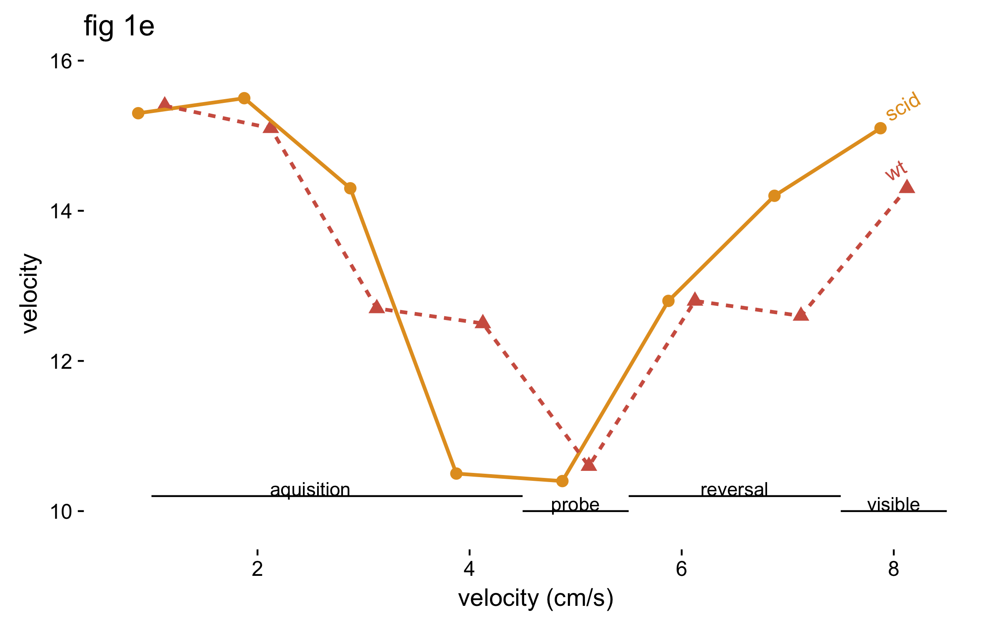

## thoughts on graph and data visualization

This markdown document is my long-deferred attempt to put down on paper some principles I think are useful when creating graphics. In my experience, scientists rarely put much effort into trying to understand what they're doing when they graph something, why they're doing it, how they con do it the best, and what their goal is in creating a visual representation of data.

In this document I will describe best practices for graphs and why I think they are the best practices (data on whether certain practices actually are better is thin though). Ideally, I'll include a bunch of example graphs here to illustrate good and bad practices.

This whole exercise is pointless, however, unless we identify what exactly it is we're trying to do:

### What _is_ a good graphic? What should a graphic do?

Your answer may deviate from mine, but to me a good graphic does two things:
* honestly shows the data
* makes it easy for the reader to understand some point you want to make

A graph is worthy of retention in a paper or a talk if it does one of these things really well. Otherwise, get rid of it. When possible--most of the time--graphics should aim to do both of these things really well. Why just show some relationship when you could actually show the data as well?

It's important to note that many graphs pass the second bullet point but deliberately ignore the first: they show you some relationship without showing you the data. Not only does this miss an upportunity to infuse your graphs with another dimension, but it a lot of cases it's dishonest. See the Anscombe's quartet example below for why this is dangerous.

## motivation: why graphs and graphics are essential

Anscombe's quartet illustrates how our trust of numbers without validating our intuition using a graphic is problematic. This quartet comprises four x, y vectors. Each pair of vectors has the same summary statistics (mean x, mean of y, covariance between x and y, and regression slopes). Yet when these four pairs of points are graphs on four scatterplots, it's clear the data are quite different:


By definition, summary statistics provide a simplified abstraction of our data, but the example above shows that we're lying to ourselves as scientists if make the fallacious mistake of relying on summary statistics to describe our data.

The image above also illustrates that our data often contains features we might not even be aware of: unknown unknowns that we simply haven't thought about or considered. For example, if I told you that two sets of data had the same means for x and y and covariances, you'd probably assume their scatterplots would look pretty similar. You probably wouldn't have even thought "I wonder if there are outliers that could cause this similarity?" or "Is it possible that the relationship between x and y could be different in this pair of data?"

As Daniel Kahneman writes about in his book _Thinking Fast and Slow_, the humans mind tends to be lazy. Part of the power of graphics is that they take tap into the strong visual processing parts of our brains and force us not to be lazy when it comes to interpreting data.

This is why graphs are so powerful and so essential.

### guiding principles about graphics

Below I outline guiding principles I think are important when creating a graphic.

* every part of the graph should have a clear purpose

   Extra bells and whistles are distracting. Often when graphs contain a bunch of things that don't need to be there, I get stuck trying to figure out what they mean, only to realize minutes later that they don't mean anything. This is not to say that all parts of a graphic should have a _unique_ purpose: redundency is an important aspect of design and I often find it useful to use in graphs, as different people probably have different ideal ways of viewing something. But if some element of our graphic isn’t serving a clear purpose, strip it away.
   
* show the data, some summary of the data or parameter estimate of interest, and some measure of variability about that estimate
* clearly label sample sizes
* state some measure of effect size
* state the the test used to assess statistical significance and the resulting p-value
* don't extrapolate

### thoughts on color

Color can be a powerful visualize element in a graphic. But it has to be used carefully and thoughtfully. 

#### issues with color schemes

There are three main issues that can plague a given color scheme:

* Not distinguishable to readers with red/green colorblindness.
* Luminance of the colors is the same, thus hard to distinguish between colors when printed in black and white.
* For quantitative data: changes in luminance of the colors does not scale linearly with changes in the underlying variable the color represents. For example, a change in luminance from 10% black to 30% black should represent a comparable increase in the variable that is being represented. 

#### recommendations

It seems like there may be too many variables to optimize here, but it's possible to develop color schemes that satisfy all these criteria. One solution is the [viridis](https://bids.github.io/colormap/) color scheme and its sister color schemes (plasma, magma, and inferno). However, these may not be suitable for qualitative data and imply some sort of ordinal ranking. The [cube helix](http://blogs.nature.com/methagora/2013/07/data-visualization-points-of-view.html) color scheme is a good alternative because their are greater changes in hue. Both of these are implemented in R (using the viridis package and the cubeHelix function of the rje package). 

An additional thought that really doesn't fit in here really well is that you should try to design figures so that they don't require captions. If you're using a lot of jargon and acronymns and representing things in a non-intuitive way, your reader has to head to the legend to even start to comprehend what's going on. Trying to tell a story with a graphic should obviate the need for a stuffed legend.

### worked examples

Let’s take a table (that somehow appeared in a _figure_ of a paper) and make it into a nice plot. Here’s the original table (paper doi 10.1016/j.bbi.2007.12.008):


Below includes are R code to recreate these figures.

#### step 1
```r
require(tidyverse)
require(ggthemes)
require(directlabels)
require(cowplot)
require(magrittr)

theme_clean <- function(font_size = 14, font_family = "", line_size = .5, rotate_labels = F) {
  half_line <- 9
  small_rel <- 0.857
  small_size <- small_rel * font_size
  
  theme_grey(base_size = font_size, base_family = font_family) %+replace%
    theme(
      rect              = element_rect(fill = "transparent", colour = NA, color = NA, size = 0, linetype = 0),
      text              = element_text(family = font_family, face = "plain", colour = "black",
                                       size = font_size, hjust = 0.5, vjust = 0.5, angle = 0, lineheight = .9,
                                       margin = ggplot2::margin(), debug = FALSE),
      axis.text         = element_text(colour = "black", size = small_size),
      #axis.title        = element_text(face = "bold"),
      axis.text.x       = element_text(margin = ggplot2::margin(t = small_size / 4), vjust = 1),
      axis.text.y       = element_text(margin = ggplot2::margin(r = small_size / 4), hjust = 1),
      axis.title.x      = element_text(
        margin = ggplot2::margin(t = small_size / 2, b = small_size / 4)
      ),
      axis.title.y      = element_text(
        angle = 90,
        margin = ggplot2::margin(r = small_size / 2, l = small_size / 4),
      ),
      axis.ticks        = element_line(colour = "black", size = line_size),
      axis.line = element_blank(), 
      legend.key        = element_blank(),
      legend.spacing     = grid::unit(0.1, "cm"),
      legend.key.size   = grid::unit(1, "lines"),
      legend.text       = element_text(size = rel(small_rel)),
      #    legend.position   = c(-0.03, 1.05),
      # legend.justification = c("left", "right"),
      panel.background  = element_blank(),
      panel.border      = element_blank(),
      panel.grid.major  = element_blank(),
      panel.grid.minor  = element_blank(),
      strip.text        = element_text(size = rel(small_rel)),
      strip.background  = element_blank(),
      plot.background   = element_blank(),
      plot.title        = element_text(size = font_size*1.2,
                                       hjust = 0)
    )
}


palette_world <- function(n, random_order = FALSE) {
  cols <- c("#e39d25", "#d16050","#5cb3e7","#4676b1","#818b98","#4c4c4c")
  # cols <- cols[c(3,4,1,2,5,6)]
  if (isTRUE(random_order))
    cols <- sample(cols)
  if (length(cols) < n)
    cols <- rep(cols, length.out = n)
  cols[1:n]
}
scale_color_world <- function(...) discrete_scale("colour", "world", palette_world, ...)
scale_fill_world <- function(...) discrete_scale("fill", "world", palette_world, ...)


day <- rep(1:8,2)
genotype = rep(c("wt","scid"), each = 8)
velocity <- c(
  15.4,
  15.1,
  12.7,
  12.5,
  10.6,
  12.8,
  12.6,
  14.3,
  15.3,
  15.5,
  14.3,
  10.5,
  10.4,
  12.8,
  14.2,
  15.1
)

fig1e <- tibble(day = day, genotype = genotype, velocity = velocity)

step_1 <- fig1e %>%
  ggplot(aes(x=day, y = velocity, group =genotype)) +
  geom_point() +
  geom_line(aes(linetype = genotype)) +
  theme_base()
```


This is an okay graph. The different types of lines differentiate between the two genotypes of mice. This is the sort of default plot you might get in R.

Problems:
- the same plotting characters are used for both genotypes of mice
- some of the points overlap
- the box around the plot is distracting and not necessary
- the legend is probably unnecessary

#### step 2

```r
step_2 <- fig1e %>%
  ggplot(aes(x=day, y = velocity, color = genotype, shape = genotype)) +
  geom_point() +
  geom_line(aes(linetype = genotype)) +
  theme_clean()

```


The genotypes are now different colors, so the lines are redundantly coded (i.e. you can use the line type and the color to distinguish the two lines). Redundancy is an important design principle. Some people may pay more attention to colors, others to the line type. Using both means that you leave no one out. The colors are sort of weird, though, and are defaults, which means you can probably do better.

The grid is gone and the layout is very simple, highlighting the data. Different plotting symbols now represent data from the two groups. But the points and lines are pretty small, we still have the legend, and the points overload.


#### step 3

```r
step_3 <- fig1e %>%
  ggplot(aes(x=day, y = velocity, color = genotype, shape = genotype)) +
  scale_color_world(guide = F) +
  geom_point(size=3, position = position_dodge(width = 0.5)) +
  geom_line(aes(linetype = genotype), size = 1, position = position_dodge(width = 0.5)) +
  scale_linetype(guide = F) +
  scale_shape(guide = F)+
  theme_clean()+
  geom_dl(label = genotype, method =list("angled.endpoints",  vjust = c(-0.5))) +
  ggtitle("fig 1e") +
  geom_dl(label = genotype, method =list("angled.endpoints",  vjust = c(-0.5)))
```


We’ve replaced the defaults with some nicer colors that can be distinguished from each other when the graph is printed in black and white. The lines are bolder and clearer and appear to take up more of the plot. The points are no longer on top of each other. The legend is gone and we’ve simply labeled each line with the correct genotype of mouse.

#### step 4

```r
fig1e %>%
  ggplot(aes(x=day, y = velocity, color = genotype, shape = genotype)) +
  scale_color_world(guide = F) +
  geom_point(size=3, position = position_dodge(width = 0.5)) +
  geom_line(aes(linetype = genotype), size = 1, position = position_dodge(width = 0.5)) +
  scale_linetype(guide = F) +
  scale_shape(guide = F)+
  theme_clean()+
  geom_dl(label = genotype, method =list("angled.endpoints",  vjust = c(-0.5))) +
  ggtitle("fig 1e") +
  xlab("velocity (cm/s)") +
  coord_cartesian(ylim= c(9.8, 16)) +
  annotate("segment", x = 1, xend = 4.5, y = 10.2, yend=10.2) +
  annotate("text", label = "aquisition", x = 2.5, y = 10.3) +
  annotate("segment", x = 4.5, xend = 5.5, y = 10, yend=10) +
  annotate("text", label = "probe", x = 5, y = 10.1) +
  annotate("segment", x = 5.5, xend = 7.5, y = 10.2, yend=10.2) +
  annotate("text", label = "reversal", x = 6.5, y = 10.3) +
  annotate("segment", x = 7.5, xend = 8.5, y = 10, yend=10) +
  annotate("text", label = "visible", x = 8, y = 10.1) 
```




Finally, we can improve things more by adding annotations directly to the plot. Now we see the dip in velocity is likely caused because the mouse is more comfortable in this test, but starts moving faster once things change again in the reversal trials. 


### some critiques / thoughts about graphics

- from doi 10.1098/rspb.2015.2097


This graph uses color well; when printed in black and white, the reader will be able to identify the different colors. The overlap of the points and the error bars are annoying and difficult to read though. This graph also doesn't show the data, which could be done using a package like `beeswarm` in R or using simple line plots. The graph could also be improved by emphasizing the connect between the colored points at transfer 20 and 100 by replacing the two points for a single color with a single line that would connect the two former points.

- from doi 10.1098/rspb.2015.2097.png


This graph does a really nice job of actually showing the data: each line represents the data from a single individual co-infected with some parasites. The thicker black line is nice because it provides a summary of the data from all the grey lines, and the reader can guess what it represents without having to read through the figure legend. Color is used nicely here--the two different colors are used to highlight single infections of two different parasites. Red and blue are ideal colors for this in that they are clear and can be read by people with color blindness.

- from 10.1371/journal.pbio.1002564


This is cool paper for several reasons, so imagine my disappointment when I got their final plot, shown above. There’s a lot of good things about this graph. The color scheme is pleasing, works for people with color-blindness, and works when printed out in black and white. The font is large enough the read easily. And a stacked bar plot is a great way to show this data.

The problem comes when the reader tries to make sense of the different colors. I started at the top: what does the yellow represent? Look to the legend: _RPa_. What’s that? Look to Table 1: _Rewarded pulling alone_. Okay. Back to the figure. Interpret. Repeat for each of the colors.

Let’s review what I had to do just to understand 1/11th of the graph: 
(1) Map a color to the behavior code using the legend.
(2) Map the behavior code to the actual behavior.
(3) Map the behavior back to the color in the graphic. 

Why is this poor design? It places too much of a burden on the reader. It requires an unnecessary number of steps to make sense of what the figure is actually showing. This is the sort of approach someone would take to intentionally obfuscate. Additionally, even if the authors preserved this scheme, the reader’s insights could be hastened by letting the reader know (e.g. with an arrow and annotation by the legend) that there is a biologically useful ordering to the colors: lighter colors represent more learning to pull the string in this experiment.

————

This is one example of lots of graphs that make use complex legends. They don’t have to. There are alternatives.

All my criticisms and the three steps traced out above could be demolished simply by labeling the colors with the full names of the behavior directly on the graph. The reader’s eyes could stay on the graph instead of roaming from the graph to the legend to the table back to the graph. Notably, there are several packages in R to facilitate the labeling of points / groups in graphs automatically: [ggrepel](https://cran.r-project.org/web/packages/ggrepel/vignettes/ggrepel.html) is one and [directlabels](https://github.com/tdhock/directlabels) is another.

### useful papers / sites
Nature methods has an awesome ongoing section about graphics: http://blogs.nature.com/methagora/2013/07/data-visualization-points-of-view.html lists them all.

------------

# choosing a plot type

For complex datasets, your visualizations might benefit from taking a step back and trying to think of how the point you're trying to make could be best represented, whether or not it uses the relatively routine technique discussed below. Some of the best graphs I've seen have been innovate, new plot types that are intuitive, natural for the data the author's present, and immediately intuitive. All your plots should be like that, but sometimes all it takes is using a routine plot type.

## familiarity vs. novelty

I like to experiment with different plot types to create visualizations that I think are honest but intuitive. Except if the graph is sort of different from what's usually done, even if it's relatively simple, people are going to hit a roadblock and think "What am I looking at? Do I know what all the elements of the plot mean?" Even the plot is better in some way, if it's not immediately recognizable, it can become suspect. People tend to like things they immediately understand.

As you experiment with different types of plots, be aware that people might not different plot types. Someone used to looking at boxplots might be confused and frustrated with confronted with a sinaplot (see below). But if we just cater to what makes people feel good inside, our visualizations won't improve and our ability to communicate and do science suffers. 

### terms

__categorical__: a variable that takes one of some number of values (categories).If you have a treatment and control group, these are categorical and _treatment_ is a categorical variable. Also called a _discrete_ or _qualitative_ variable.

__continuous__: a variable that takes only position on the real line within some range. The miles per gallon that your car gets does not fall into categories: it's simply some number greater than zero. Also called a _quantitative_ variable. 

## categorical x continuous

A really common type of plot is used to show the relationship between a categorical variable on the x-axis and a continuous variable on the y-axis. Here are some different types of plots you might use to represent that data:

| plot type | information shown | in ggplot | shows the data? | shows summary? | shows sample size? |
| ---- | ---- | ---- | ---- | ---- | ---- |
| bar plot | using just means. sometimes some measure of variation (standard error or standard deviation) | `geom_bar()` or `geom_col()` | no | yes | no |
| boxplot | five number summary (the location of each quartile + the median) + any outliter | `geom_boxplot()` | no | yes | no |
| beeswarm | all the data points arranged to reduce overploting  | `geom_beeswarm()` in the _ggbeeswarm_ package | yes | no |
| jitter plot | the data jittered about the x-axis |`geom_jitter()` | yes | no; can sometimes show a line for the mean | yes |
| violin plot | smoothed density kernel of each subset of data (think smoothed histogram, corrected for differences in sample size) | `geom_violin()` | no | no | no |
| sinaplot | the data arranged so that they form a violin-like plot | `geom_sina` in the _ggforce_ package | yes | no | yes|

Usually people immediately go for a bar plot or a boxplot. Bar plots, from a data visualization standpoint, are pretty useless. They represent a single summary statistic for each your groups of data, though they do that really well: a bar is easy to see and compare with other bars. The same can't really be said for a boxplot, but a boxplot _does_ give you a sense of how the data are distributed. 

Both of these plot types, while really popular, how one huge disadvantage: they don't actually show the data. This is one of the functions that a plot should do (although there are exceptions). But avoiding plotting the data, many questions don't even enter the reader's mind, like:

> What are the sample sizes?     
> The authors used a t-test, implying these data are normally distributed? Are they?      
> Do the author have enough data to be running parametric statistics?       
> (When looking at a bar plot): What's the variation in the data? Is it a lot or a little?


I was struck at a seminar when someone presented some data using a jitter plot and he was immediately asked some question about the amount of variation in his data. The person asking the question would have never asked the question if the data were presented as a bar plot. Although it might be annoying for authors, plotting data and actually _showing_ the data is more honest, more transparent, and better for the scientific process.

Of the other plot types, I find the violin plot the most useless. Although it gives you a good sense of the distribution of the data, it doesn't give the reader a summary statistic, or an indicator of sample size, and it doesn't show the data. 

Jitter plots can be useful but suffer from over plotting. Beeswarm plots are nice, reduce overplotting, and show the data, although in the process they can make funky shapes that can be distracting to the viewer. Sinaplots compare the nice visualizaiton of a violin plot with actually showing the data, and unlike a lot of plot types, can be used with groups that vary a in their number of observations (a sinaplot with few observations just looks like a jitter or strip plot). The disadvantages of the sinaplot are: (a) too novel, (b) no summary statistic / measure of effect size. It's possible that plotting a transparent boxplot over the sinaplot might ameliroate these two conerns, but then the plot starts looking too busy. Play around with these an see what you think

#### examples

Here are some plots from a relatively large dataset of water striders. The categorical variable is the stream used in the experiment and the y-axis is some measure of activity. The data are available [here](http://datadryad.org/bitstream/handle/10255/dryad.131091/metadata.txt?sequence=1):

bar plot:

`df %>% group_by(stream) %>% summarise(avg = mean(slope.activity.nbmales, na.rm=T)) %>% ggplot(aes(factor(stream), avg)) + theme_pander() + geom_col(aes(fill = factor(stream))) + scale_fill_world(guide = F) + xlab("stream") + ylab("activity") + ggtitle("bar plot")`


boxplot:

`df %>% ggplot(aes(factor(stream), slope.activity.nbmales)) + theme_pander() + geom_boxplot(aes(fill = factor(stream))) + scale_fill_world(guide = F)   + xlab("stream") + ylab("activity") + ggtitle("boxplot")`


beeswarm


violinplot

`df %>% ggplot(aes(factor(stream), slope.activity.nbmales)) + theme_pander() + geom_violin(aes(fill = factor(stream))) + scale_fill_world(guide = F)   + xlab("stream") + ylab("activity") + ggtitle("violin plot")`


jitter

`df %>% ggplot(aes(factor(stream), slope.activity.nbmales)) + theme_pander() + geom_jitter(height = 0, width = 0.15, aes(color = factor(stream))) + scale_color_world(guide = F)   + xlab("stream") + ylab("activity") + ggtitle("jitter plot")`


sinaplot

`df %>% ggplot(aes(factor(stream), slope.activity.nbmales)) + theme_pander() + geom_sina(aes(color = factor(stream))) + scale_color_world(guide = F)   + xlab("stream") + ylab("activity") + ggtitle("sinaplot")`


sinaplot + boxplot:

`df %>% ggplot(aes(factor(stream), slope.activity.nbmales)) + theme_pander() + geom_sina(aes(color = factor(stream))) + scale_color_world(guide = F)   + xlab("stream") + ylab("activity") + ggtitle("sinaplot + boxplot") + geom_boxplot(outlier.colour = NA, alpha = 1/1000)`


